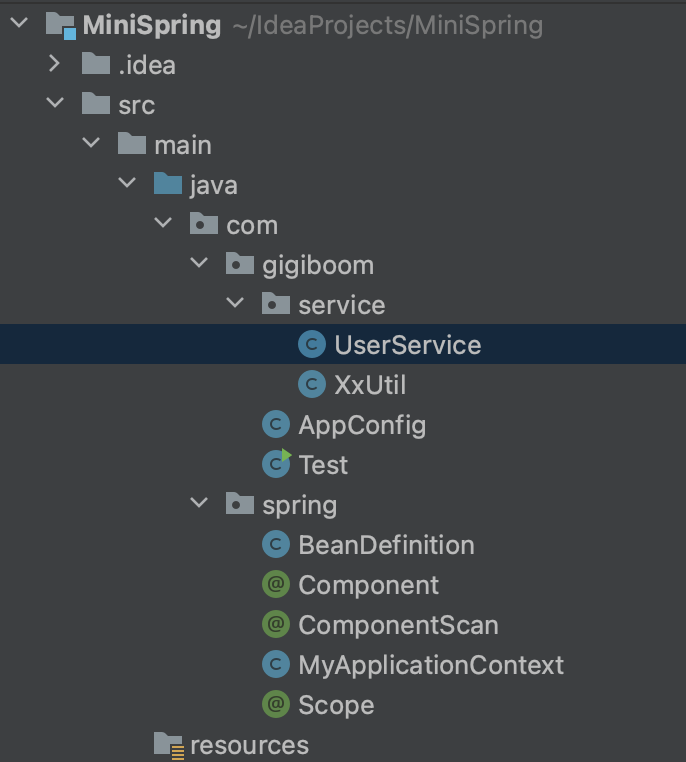
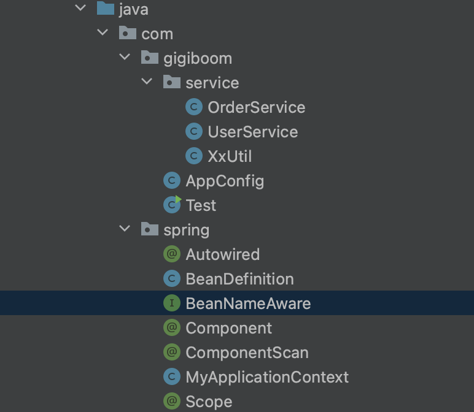
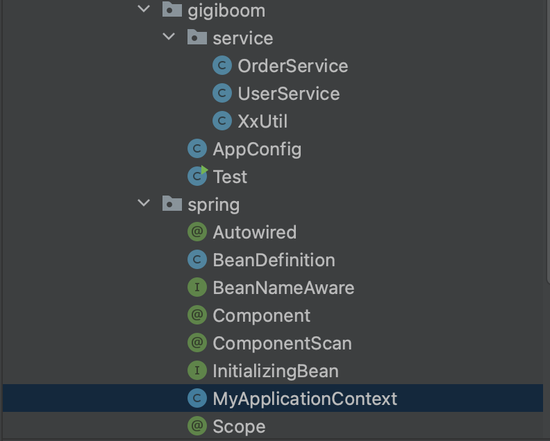
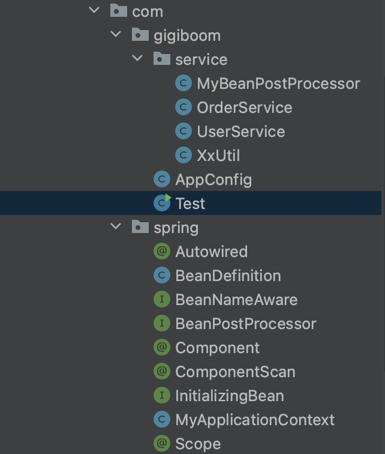
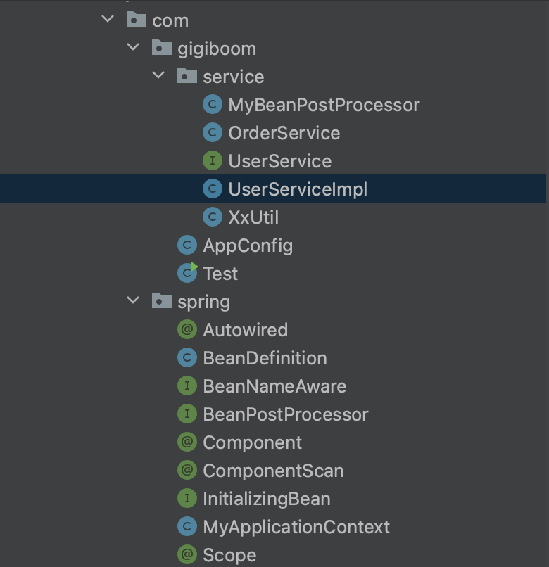

# MiniSpring
实现一个小的Spring框架
## 手写Spring（一）----启动以及扫描逻辑

**项目架构（暂时）**

- 

* UserService：模拟一个带有Component注解的bean

* XxUtil：模拟一个没有Component注解的普通类（不重要）
* AppConfig：自定义配置类---定义ComponentScan范围

* Test：测试类
* BeanDefinition：记录bean加载后的Class对象以及scope属性(是否为单例bean)
* Component注解

* ComponentScan注解
* MyApplicationContext：自定义Spring容器类
* Scope注解

**启动类**

```java
public class Test {
    public static void main(String[] args) {
        // 根据配置类新建Spring容器对象
        MyApplicationContext applicationContext = new MyApplicationContext(AppConfig.class);
        Object userService = applicationContext.getBean("userService");
    }
}
```

```java
// AppConfig
@ComponentScan("com.gigiboom.service")
public class AppConfig {
}
```

**扫描逻辑实现**

>**ComponentScan注解-->扫描路径-->扫描-->BeanDefinition-->BeanDefinitionMap**

* 获取ComponentScan注解,并取value转换成扫描路径

* 扫描路径目录下的class文件并加载类
* 查看该类是否有Component注解，有表示当前类是一个bean，获取bean的名字beanName
* 查看该类是否有Scope注解，没有代表是个单例bean，有则获取Scope注解的value

* 将bean的class对象和scope属性存入BeanDefinition类

```java
public class BeanDefinition {
    private Class clazz; // bean加载后的Class对象
    private String scope;// scope属性(singleton为单例bean)
    
    ---getter setter方法---
}
```

* 将bean的beanName和beanDefinition存入BeanDefinitionMap类

```Java
private ConcurrentHashMap<String, BeanDefinition> beanDefinitionMap = new ConcurrentHashMap<>();
```

**容器类的构造方法**

* 扫描流程得到beanDefinitionMap
* 遍历beanDefinitionMap找到所有的单例bean
* 创造bean对象(createBean方法)并将beanName和bean存入单例池

```java
// 单例池，存储单例对象
private ConcurrentHashMap<String, Object> singletonObjects = new ConcurrentHashMap<>();
```

**容器getBean方法**

* 通过beanDefinitionMap对象查看是否为单例bean
* 如果是单例bean，从单例池中取单例bean对象返回
* 如果不是单例bean，创建新bean对象返回

**此阶段MyApplicationContext代码**

```java
public class MyApplicationContext {

    private Class configClass;

    // 单例池，存储单例对象
    private ConcurrentHashMap<String, Object> singletonObjects = new ConcurrentHashMap<>(); 
    // 存所有bean的定义
    private ConcurrentHashMap<String, BeanDefinition> beanDefinitionMap = new ConcurrentHashMap<>(); 

    public MyApplicationContext(Class configClass) {
        this.configClass = configClass;

        // 解析配置类：ComponentScan注解-->扫描路径-->扫描-->BeanDefinition-->BeanDefinitionMap
        scan(configClass);

        for (Map.Entry<String, BeanDefinition> entry : beanDefinitionMap.entrySet()) {
            String beanName = entry.getKey();
            BeanDefinition beanDefinition = entry.getValue();
            if (beanDefinition.getScope().equals("singleton")) {
                Object bean = createBean(beanDefinition);// 单例bean
                singletonObjects.put(beanName, bean);
            }
        }

    }
    public Object createBean(BeanDefinition beanDefinition) {

        Class clazz = beanDefinition.getClazz();
        try {
            // 调用无参构造方法反射一个实例对象
            Object instance = clazz.getDeclaredConstructor().newInstance();

            return instance;
        } catch (InstantiationException e) {
            throw new RuntimeException(e);
        } catch (IllegalAccessException e) {
            throw new RuntimeException(e);
        } catch (InvocationTargetException e) {
            throw new RuntimeException(e);
        } catch (NoSuchMethodException e) {
            throw new RuntimeException(e);
        }
    }

    private void scan(Class configClass) {

        // 获取ComponentScan注解
        ComponentScan componentScanAnnotation = (ComponentScan) configClass.getDeclaredAnnotation(ComponentScan.class);

        // 获取扫描路径
        String path = componentScanAnnotation.value();
        path = path.replace(".", "/");
        System.out.println(path);

        // 扫描
        // 三种类加载器
        // BootStrap-->jre/lib
        // Ext-------->jre/ext/lib
        // App-------->classpath
        ClassLoader classLoader = MyApplicationContext.class.getClassLoader(); // app
        URL resource = classLoader.getResource(path);// 相对路径获取资源
        File file = new File(resource.getFile());
        if (file.isDirectory()) {
            File[] files = file.listFiles();
            for (File f : files) { // 遍历目录下的文件
                System.out.println(f);

                String fileName = f.getAbsolutePath();
                if (fileName.endsWith(".class")) {  // 处理类文件

                    String className = fileName.substring(fileName.indexOf("com"), fileName.indexOf(".class"));
                    className = className.replace("/", "."); // 转换类的全路径名
                    System.out.println(className);

                    try {
                        Class<?> clazz = classLoader.loadClass(className); // 加载类
                        if (clazz.isAnnotationPresent(Component.class)) {
                            // 表示当前类是一个Bean
                            // 解析类，判断当前是单例bean，还是prototype的bean-原型bean,
                            // 解析类-->BeanDefinition

                            // 获取bean的名字
                            Component componentAnnotation = clazz.getDeclaredAnnotation(Component.class);
                            String beanName = componentAnnotation.value();

                            BeanDefinition beanDefinition = new BeanDefinition();
                            beanDefinition.setClazz(clazz);

                            if (clazz.isAnnotationPresent(Scope.class)) {
                                Scope scopeAnnotation = clazz.getDeclaredAnnotation(Scope.class);
                                beanDefinition.setScope(scopeAnnotation.value());
                            } else {
                                // 单例bean
                                beanDefinition.setScope("singleton");
                            }
                            beanDefinitionMap.put(beanName, beanDefinition);

                        }
                    } catch (ClassNotFoundException e) {
                        throw new RuntimeException(e);
                    }

                }
            }
        }
    }

    public Object getBean(String beanName) {
        if (beanDefinitionMap.containsKey(beanName)) {
            BeanDefinition beanDefinition = beanDefinitionMap.get(beanName);
            if (beanDefinition.getScope().equals("singleton")) {
                // 单例对象从单例池中取
                Object o = singletonObjects.get(beanName);
                return o;
            } else {
                // 非单例，创建bean对象返回
                Object bean = createBean(beanDefinition);
                return bean;
            }
        } else {
            // 对应的bean不存在
            throw new NullPointerException();
        }
    }
}
```

**测试代码**

```java
public class Test {
    public static void main(String[] args) {
        MyApplicationContext applicationContext = new MyApplicationContext(AppConfig.class);

        System.out.println(applicationContext.getBean("userService"));
        System.out.println(applicationContext.getBean("userService"));
        System.out.println(applicationContext.getBean("userService"));
    }
}
```

**测试结果**

```bash
# UserService无Scope注解(单例，得到同一个bean)
com.gigiboom.service.UserService@3feba861
com.gigiboom.service.UserService@3feba861
com.gigiboom.service.UserService@3feba861
# UserService有Scope注解(得到不同bean)
com.gigiboom.service.UserService@5b480cf9
com.gigiboom.service.UserService@6f496d9f
com.gigiboom.service.UserService@723279cf
```


## 手写Spring（二）----依赖注入模拟实现及Aware回调函数

**项目架构（暂时）**

- 

变化：

* Autowired注解
* BeanNameAware接口

```java
public interface BeanNameAware {
    void setBeanName(String name);
}
```

* OrderService：模拟一个带有Component注解的bean，且被注入到UserService中

```java
@Component("userService")
@Scope("prototype")
public class UserService implements BeanNameAware {// Spring将判断bean是否实现了BeanNameAware接口，并注入相应的值

    @Autowired // 加了Autowired后，Spring应该已经给orderService赋好值了----自动注入
    private OrderService orderService;

    private String beanName;

    @Override
    public void setBeanName(String name) {
        beanName = name;
    }

    public void test() {
        System.out.println(orderService);
        System.out.println(beanName);
    }
}
```

**依赖注入**

>判断bean的字段是否存在Autowired注解--->存在--->Spring应该已经给字段自动赋值(自动注入)

* 得到bean的class对象，并调用无参构造方法反射一个实例对象

```java
Class clazz = beanDefinition.getClazz();
// 调用无参构造方法反射一个实例对象
Object instance = clazz.getDeclaredConstructor().newInstance();
```

* 依赖注入：遍历实例对象的属性选择Autowired注解的属性并赋值

```java
// 依赖注入--对实例对象的属性赋值
for (Field declaredField : clazz.getDeclaredFields()) {
    // 加了Autowired注解的属性才需要Spring自动赋值
    if (declaredField.isAnnotationPresent(Autowired.class)) {

        // 通过name得到bean对象
        Object bean = getBean(declaredField.getName());

        // 设置一个类的私有成员变量（declaredField）为可访问
        declaredField.setAccessible(true);

        // 给instance对象里面的declaredField属性赋值
        declaredField.set(instance, bean);
    }
}
```

**Aware回调函数**

>回调主要是判断bean是否实现了BeanNameAware，BeanFactoryAware等各种接口，类似于按接口判断还有哪些属性需要注入，来实现对bean的扩展

```java
// 判断instance对象是否实现BeanNameAware接口
if (instance instanceof BeanNameAware) {
    // 实现接口方法
    ((BeanNameAware) instance).setBeanName(beanName);
}
```

**完整createBean方法**

```java
public Object createBean(String beanName, BeanDefinition beanDefinition) {

    Class clazz = beanDefinition.getClazz();
    try {
        // 调用无参构造方法反射一个实例对象
        Object instance = clazz.getDeclaredConstructor().newInstance();

        // 依赖注入--对实例对象的属性赋值
        for (Field declaredField : clazz.getDeclaredFields()) {
            // 加了Autowired注解的属性才需要Spring自动赋值
            if (declaredField.isAnnotationPresent(Autowired.class)) {
                // 通过name得到bean对象
                Object bean = getBean(declaredField.getName());
                // 设置一个类的私有成员变量（declaredField）为可访问
                declaredField.setAccessible(true);
                // 给instance对象里面的declaredField属性赋值
                declaredField.set(instance, bean);
            }
        }
        // 判断instance对象是否实现BeanNameAware接口
        if (instance instanceof BeanNameAware) {
            ((BeanNameAware) instance).setBeanName(beanName);
        }
        return instance;
    } catch (InstantiationException e) {
        throw new RuntimeException(e);
    } catch (IllegalAccessException e) {
        throw new RuntimeException(e);
    } catch (InvocationTargetException e) {
        throw new RuntimeException(e);
    } catch (NoSuchMethodException e) {
        throw new RuntimeException(e);
    }
}
```

**测试代码**

```java
public class Test {
    public static void main(String[] args) {
        MyApplicationContext applicationContext = new MyApplicationContext(AppConfig.class);

        UserService userService = (UserService) applicationContext.getBean("userService");
        userService.test();
    }
}
```

**测试结果**

```bash
# 得到了自动注入的orderService对象
com.gigiboom.service.OrderService@7291c18f
# 得到了自动注入的beanName
userService
```


## 手写Spring（三）----初始化机制

**项目架构**

- 

变化：

* InitializingBean:bean的初始化接口，声明了afterPropertiesSet()方法

```java
public interface BeanNameAware {
    void setBeanName(String name);
}
```

* UserService实现了InitializingBean接口

```java
@Component("userService")
@Scope("prototype")
public class UserService implements InitializingBean {

    @Autowired
    private OrderService orderService;

    @Override
    public void afterPropertiesSet() throws Exception {
        // Spring提供的初始化机制，程序员自定义实现逻辑
        System.out.println("初始化");
    }
}
```

**初始化**

> 初始化和之前Aware回调差不多，判断bean是否实现InitializingBean()接口，然后重写当中的afterPropertiesSet()方法

```java
if (instance instanceof InitializingBean) {
    try {
        ((InitializingBean) instance).afterPropertiesSet();
    } catch (Exception e) {
        throw new RuntimeException(e);
    }
}
```

**测试代码**

```java
public class Test {
    public static void main(String[] args) {
        MyApplicationContext applicationContext = new MyApplicationContext(AppConfig.class);

        UserService userService = (UserService) applicationContext.getBean("userService"); // 应该已经自动初始化
    }
}
```

**测试结果**

```bash
# 已经重写afterPropertiesSet()方法---System.out.println("初始化");
初始化
```


## 手写Spring（四）----BeanPostProcessor

**项目架构**

- 

变化：

* BeanPostProcessor接口
* MyBeanPostProcessor实现类

**BeanPostProcessor**

> 这个接口是后置处理器接口，可分为before，after，声明了postProcessBeforeInitialization、 postProcessAfterInitialization方法

```java
public interface BeanPostProcessor {
    Object postProcessBeforeInitialization(Object bean, String beanName);
    Object postProcessAfterInitialization(Object bean, String beanName);
}
```

* Before:在实例化、依赖注入完毕，在调用显示的初始化前完成一些定制的初始化任务
* after:实例化、依赖注入、初始化完毕时执行

**MyBeanPostProcessor--BeanPostProcessor实现类**

> 将MyBeanPostProcessor加上Component注解作为bean注入到spring
>
> Spring在扫描时收集所有的BeanPostProcessor实现类存入list
>
> 在createBean中的初始化前后依次调用所有的beanPostProcessor实现类重写的before、after方法

* MyBeanPostProcessor

```java
@Component // 将其也设置为一个bean
// Spring发现这个bean实现了BeanPostProcessor接口，会做特殊处理
public class MyBeanPostProcessor implements BeanPostProcessor {
    // 创建所有的bean都会走这个流程
    @Override
    public Object postProcessBeforeInitialization(Object bean, String beanName) { // 初始化前
        System.out.println("初始化前");
        // 如果想对特定的bean做操作
        if (beanName.equals("userService")) {
            ((UserService)bean).setName("gigiboom,帅");
        }
        return bean;
    }

    @Override
    public Object postProcessAfterInitialization(Object bean, String beanName) { // 初始化后
        System.out.println("初始化后");
        return bean;
    }
}
```

* 声明存储BeanPostProcessor实现类的list

```java
private List<BeanPostProcessor> beanPostProcessorList = new ArrayList<>();
```

* 扫描收集

```java
Class<?> clazz = classLoader.loadClass(className); // 加载类
if (clazz.isAnnotationPresent(Component.class)) {

    // 判断clazz对象是否实现了BeanPostProcessor接口
    if (BeanPostProcessor.class.isAssignableFrom(clazz)) {
        BeanPostProcessor instance = (BeanPostProcessor) clazz.getDeclaredConstructor().newInstance(); // 实例化对象
        beanPostProcessorList.add(instance);// 存入list
        // --后续操作省略--
    }
}
```

* createBean中调用

```java
// 初始化前
for (BeanPostProcessor beanPostProcessor : beanPostProcessorList) {
    instance = beanPostProcessor.postProcessBeforeInitialization(instance, beanName);
}

// 初始化
if (instance instanceof InitializingBean) {
    try {
        ((InitializingBean) instance).afterPropertiesSet();
    } catch (Exception e) {
        throw new RuntimeException(e);
    }
}

// 初始化后
for (BeanPostProcessor beanPostProcessor : beanPostProcessorList) {
    instance = beanPostProcessor.postProcessAfterInitialization(instance, beanName);
}
```

**测试代码**

```java
public class Test {
    public static void main(String[] args) {
        MyApplicationContext applicationContext = new MyApplicationContext(AppConfig.class);

        UserService userService = (UserService) applicationContext.getBean("userService");
        userService.test();
    }
}
```

**测试结果**

```bash
# 其他bean，所有bean都会走BeanPostProcessor流程
初始化前
初始化后
初始化前
初始化后
# UserService的bean
初始化前 # before方法
初始化   # 初始化方法
初始化后 # after方法
com.gigiboom.service.OrderService@6e8cf4c6 # test方法System.out.println(orderService);
# test方法System.out.println(name);
# MyBeanPostProcessor对特定的bean(UserService)设置了name属性
gigiboom,帅 
```


## 手写Spring（五）----AOP

**项目架构**

- 

变化：

* 原UserService类更名为UserServiceImpl
* 新增UserService接口

**AOP实现**

> 在createBean方法中，BeanPostProcessor的after是最后一步，故after返回的对象就是createBean方法最终返回的对象
>
> AOP就是利用BeanPostProcessor的初始化后after方法实现
>
> after方法返回代理对象，代理对象会先执行代理逻辑，再执行原本的业务逻辑

* after方法
* 由于所有的bean都会走after方法，故在after方法中可以去查看当前bean是否匹配切面(真实开发中会传入切面list，当前用userService代替)，若匹配则会生成并返回代理对象
* 代理对象会先执行代理（真实开发中会去寻找切点，然后执行相应的真实逻辑），然后再执行bean对象原始的方法

```java
@Override
public Object postProcessAfterInitialization(Object bean, String beanName) { // 初始化后
    System.out.println("初始化后");
    // 匹配切面
    if (beanName.equals("userService")) {
        // 生成代理对象
        Object proxyInstance = Proxy.newProxyInstance(MyBeanPostProcessor.class.getClassLoader(), bean.getClass().getInterfaces(), new InvocationHandler() {
            @Override
            public Object invoke(Object proxy, Method method, Object[] args) throws Throwable {
                // 先执行代理逻辑
                System.out.println("代理逻辑"); // 找切点
                // 执行被代理的bean的原始方法
                return method.invoke(bean, args);
            }
        });
        return proxyInstance;
    }
    return bean;
}
```

**测试代码**

```java
public class Test {
    public static void main(String[] args) {
        MyApplicationContext applicationContext = new MyApplicationContext(AppConfig.class);

        UserService userService = (UserService) applicationContext.getBean("userService");
        userService.test();
    }
}
```

**测试结果**

```bash
初始化前
初始化后
代理逻辑 # 先执行代理逻辑
# 后执行原始方法
com.gigiboom.service.OrderService@7530d0a
gigiboom,帅
```

